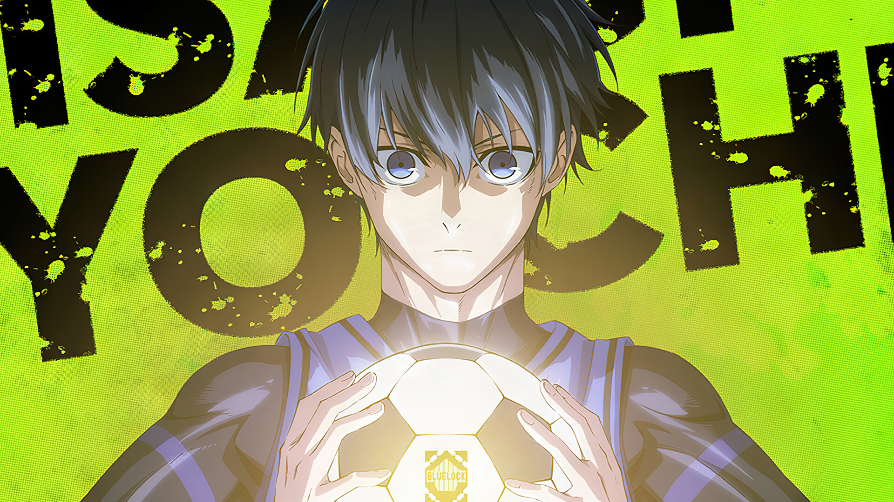

# Blue Lock — Isagi Awakening

An interactive HTML5 canvas experience showcasing Isagi Yoichi's "Direct" awakening from the anime/manga *Blue Lock*. Move your cursor across the screen to reveal the awakened form beneath the surface.

## Preview



## Features

- **Interactive Reveal Effect** — Mouse/touch movement reveals the "awakened" image through a dynamic circular mask
- **Smooth Trail Animation** — Cursor leaves a fading trail that follows with easing
- **Glow Effect** — Radial gradient glow at the cursor position
- **Responsive Design** — Works on desktop and mobile (touch support)
- **Zero Dependencies** — Pure vanilla HTML, CSS, and JavaScript

## How It Works

The experience uses two images:
- **1.jpg** — Base "calm" image (Isagi before awakening)
- **2.png** — "Awakened" image (Isagi in Direct/Ego mode)

A canvas overlay renders a dynamic mask that follows the cursor, revealing the top image through a circular area with a trailing effect.

## Getting Started

Simply open `isagi.html` in a modern browser:

```bash
# Option 1: Direct file open
open isagi.html

# Option 2: Serve locally (recommended for CORS-free image loading)
npx serve .
# or
python -m http.server 8000
```

## Customization

Replace the images in the HTML to create your own reveal experience:

```javascript
// Lines 147-148 in isagi.html
bottom.src = "./1.jpg"  // Base image
top.src = "./2.png";    // Reveal image
```

Recommended: Use images with the same aspect ratio for best results.

## Tech Stack

- HTML5 Canvas API
- Vanilla JavaScript (ES6+)
- CSS3 (Custom properties, animations, clip-path)
- Google Fonts (Anton, Russo One, Bebas Neue, Oswald)

## Credits

- **Blue Lock** — Original work by Muneyuki Kaneshiro (story) and Yusuke Nomura (art)
- **Character** — Isagi Yoichi
- **Concept** — "Direct" / "Meta Vision" awakening

## License

Fan project for demonstration purposes. Blue Lock IP belongs to its respective owners.